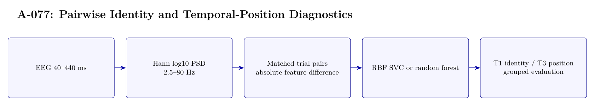

# A-077 Architecture

The image above is rendered from [`ARCHITECTURE.tex`](ARCHITECTURE.tex).

## Data flow

1. EEG 40--440 ms
2. Hann log10 PSD — 2.5--80 Hz
3. Matched trial pairs — absolute feature difference
4. RBF SVC or random forest
5. T1 identity / T3 position — grouped evaluation

## Training interface

- Objective: RBF SVC and random-forest binary classification; no neural embedding objective.
- Subject scope: All sixteen subjects.
- Temporal-effect control: Mixed: T1 uses image-disjoint 48/16/16 splits; T3 deliberately measures position-order effects. T2 is omitted because no session label exists.

## Authoritative implementation

- [`scripts/a077_prepare_pair_tasks.py`](scripts/a077_prepare_pair_tasks.py)
- [`scripts/a077_run_models.py`](scripts/a077_run_models.py)
- [`config/a077_pair_tasks.json`](config/a077_pair_tasks.json)
