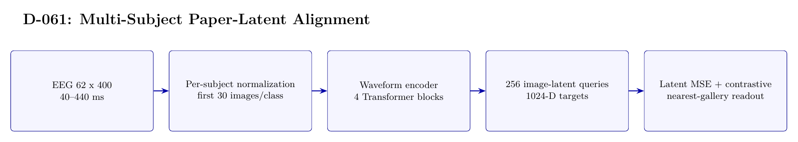

# D-061 Architecture

The image above is rendered from [`ARCHITECTURE.tex`](ARCHITECTURE.tex).

## Data flow

1. EEG 62 x 400 — 40--440 ms
2. Per-subject normalization — first 30 images/class
3. Waveform encoder — 4 Transformer blocks
4. 256 image-latent queries — 1024-D targets
5. Latent MSE + contrastive — nearest-gallery readout

## Training interface

- Objective: Image-latent MSE plus 0.1 symmetric contrastive loss; not cross-entropy classification.
- Subject scope: Sixteen subjects, fitted independently for each subject/task combination.
- Temporal-effect control: Not excluded: training uses the first 30 source-order images per class and evaluation uses the last 20.

## Authoritative implementation

- [`scripts/run_d061_paper_latent.py`](scripts/run_d061_paper_latent.py)
- [`config/d061_paper_latent_s17.json`](config/d061_paper_latent_s17.json)
