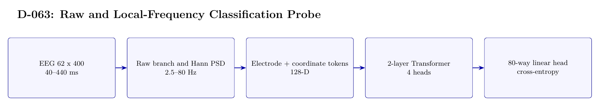

# D-063 Architecture

The image above is rendered from [`ARCHITECTURE.tex`](ARCHITECTURE.tex).

## Data flow

1. EEG 62 x 400 — 40--440 ms
2. Raw branch and Hann PSD — 2.5--80 Hz
3. Electrode + coordinate tokens — 128-D
4. 2-layer Transformer — 4 heads
5. 80-way linear head — cross-entropy

## Training interface

- Objective: Ordinary 80-way cross-entropy classification.
- Subject scope: Subject 0 only.
- Temporal-effect control: Not excluded: the first 30 source-order images per class train the probe and the last 20 form the test set.

## Authoritative implementation

- [`scripts/run_d063_local_frequency_probe.py`](scripts/run_d063_local_frequency_probe.py)
- [`config/d063_local_frequency_probe.json`](config/d063_local_frequency_probe.json)
