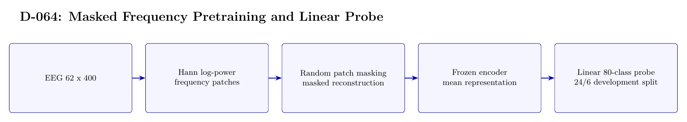

# D-064 Architecture

The image above is rendered from [`ARCHITECTURE.tex`](ARCHITECTURE.tex).

## Data flow

1. EEG 62 x 400
2. Hann log-power — frequency patches
3. Random patch masking — masked reconstruction
4. Frozen encoder — mean representation
5. Linear 80-class probe — 24/6 development split

## Training interface

- Objective: Masked reconstruction pretraining followed by an 80-way linear probe; probe training uses cross-entropy.
- Subject scope: Subject 0 only.
- Temporal-effect control: Partially controlled inside the first 30: positions 0--23 fit and 24--29 validate; the official last 20 are excluded from evaluation.

## Authoritative implementation

- [`scripts/run_d064_mask_ratio.py`](scripts/run_d064_mask_ratio.py)
- [`config/d064_local_mask_ratio.json`](config/d064_local_mask_ratio.json)
