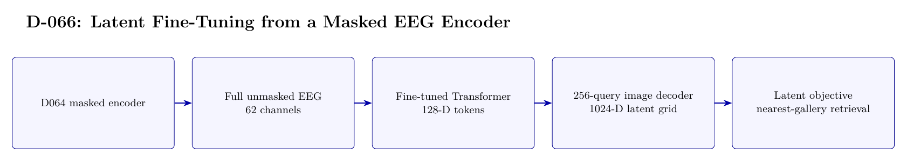

# D-066 Architecture

The image above is rendered from [`ARCHITECTURE.tex`](ARCHITECTURE.tex).

## Data flow

1. D064 masked encoder
2. Full unmasked EEG — 62 channels
3. Fine-tuned Transformer — 128-D tokens
4. 256-query image decoder — 1024-D latent grid
5. Latent objective — nearest-gallery retrieval

## Training interface

- Objective: Image-latent MSE plus 0.1 symmetric contrastive loss; not cross-entropy classification.
- Subject scope: Subject 0 only, with three random seeds.
- Temporal-effect control: Not excluded: the first 30 source-order images per class train the model and the last 20 are evaluated.

## Authoritative implementation

- [`scripts/run_d066_latent_finetune.py`](scripts/run_d066_latent_finetune.py)
- [`config/d066_latent_finetune.json`](config/d066_latent_finetune.json)
