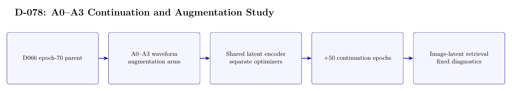

# D-078 Architecture

The image above is rendered from [`ARCHITECTURE.tex`](ARCHITECTURE.tex).

## Data flow

1. D066 epoch-70 parent
2. A0--A3 waveform — augmentation arms
3. Shared latent encoder — separate optimizers
4. +50 continuation epochs
5. Image-latent retrieval — fixed diagnostics

## Training interface

- Objective: Image-latent MSE plus 0.1 symmetric contrastive loss; not cross-entropy classification.
- Subject scope: Subject 0 only.
- Temporal-effect control: Not excluded: the historical first-30/last-20 source-order split is retained.

## Authoritative implementation

- [`scripts/d078_run_continuation.py`](scripts/d078_run_continuation.py)
- [`src/d078_augmentation.py`](src/d078_augmentation.py)
- [`config/d078_a100_continuation.json`](config/d078_a100_continuation.json)
