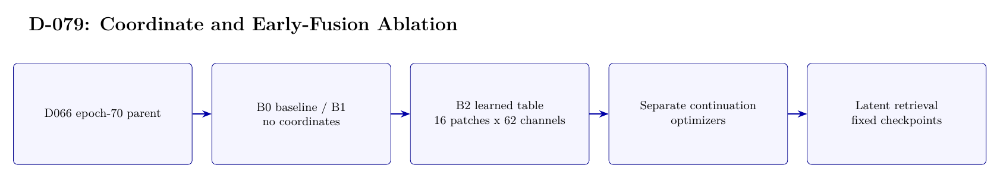

# D-079 Architecture

The image above is rendered from [`ARCHITECTURE.tex`](ARCHITECTURE.tex).

## Data flow

1. D066 epoch-70 parent
2. B0 baseline / B1 no coordinates
3. B2 learned table — 16 patches x 62 channels
4. Separate continuation — optimizers
5. Latent retrieval — fixed checkpoints

## Training interface

- Objective: Image-latent MSE plus 0.1 symmetric contrastive loss; not cross-entropy classification.
- Subject scope: Subject 0 only.
- Temporal-effect control: Not excluded: the historical first-30/last-20 source-order split is retained.

## Authoritative implementation

- [`scripts/d079_run_no_coord_early_fusion.py`](scripts/d079_run_no_coord_early_fusion.py)
- [`src/d079_architecture.py`](src/d079_architecture.py)
- [`config/d079_no_coord_early_fusion.json`](config/d079_no_coord_early_fusion.json)
