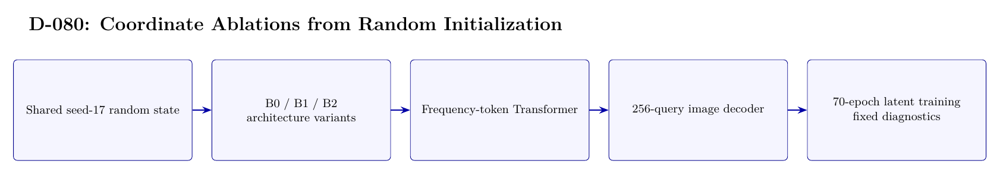

# D-080 Architecture

The image above is rendered from [`ARCHITECTURE.tex`](ARCHITECTURE.tex).

## Data flow

1. Shared seed-17 random state
2. B0 / B1 / B2 — architecture variants
3. Frequency-token Transformer
4. 256-query image decoder
5. 70-epoch latent training — fixed diagnostics

## Training interface

- Objective: Image-latent MSE plus 0.1 symmetric contrastive loss; not cross-entropy classification.
- Subject scope: Subject 0 only.
- Temporal-effect control: Not excluded: training uses the first 30 source-order images per class and diagnostics use the last 20.

## Authoritative implementation

- [`scripts/d080_run_from_scratch.py`](scripts/d080_run_from_scratch.py)
- [`src/d080_from_scratch.py`](src/d080_from_scratch.py)
- [`config/d080_from_scratch_no_coord.json`](config/d080_from_scratch_no_coord.json)
