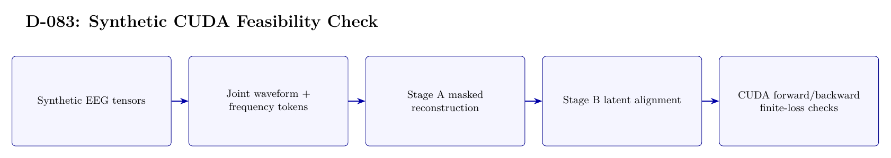

# D-083 Architecture

The image above is rendered from [`ARCHITECTURE.tex`](ARCHITECTURE.tex).

## Data flow

1. Synthetic EEG tensors
2. Joint waveform + frequency tokens
3. Stage A masked reconstruction
4. Stage B latent alignment
5. CUDA forward/backward — finite-loss checks

## Training interface

- Objective: Stage-A masked reconstruction and Stage-B latent alignment on synthetic tensors.
- Subject scope: No real subject data; synthetic feasibility only.
- Temporal-effect control: Not applicable: no EEG-ImageNet train/test split is used.

## Authoritative implementation

- [`scripts/d083_local_gpu_feasibility.py`](scripts/d083_local_gpu_feasibility.py)
- [`src/d081_joint_waveform_frequency.py`](src/d081_joint_waveform_frequency.py)
- [`src/d081_training.py`](src/d081_training.py)
