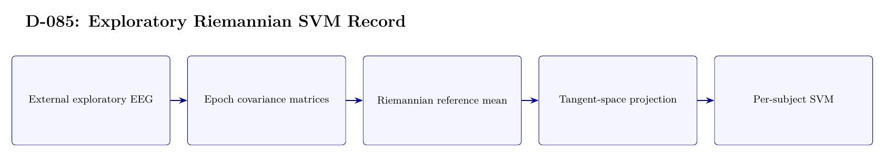

# D-085 Architecture

The image above is rendered from [`ARCHITECTURE.tex`](ARCHITECTURE.tex).

## Data flow

1. External exploratory EEG
2. Epoch covariance matrices
3. Riemannian reference mean
4. Tangent-space projection
5. Per-subject SVM

## Training interface

- Objective: Covariance features, tangent-space projection, and SVM classification.
- Subject scope: Per-subject evaluation on the exploratory external dataset.
- Temporal-effect control: Not applicable to the EEG-ImageNet first-30/last-20 protocol.

## Authoritative implementation

- No runnable public source is retained for this historical record.
