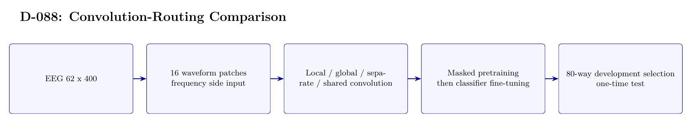

# D-088 Architecture

The image above is rendered from [`ARCHITECTURE.tex`](ARCHITECTURE.tex).

## Data flow

1. EEG 62 x 400
2. 16 waveform patches — frequency side input
3. Local / global / separate / shared convolution
4. Masked pretraining — then classifier fine-tuning
5. 80-way development selection — one-time test

## Training interface

- Objective: Masked JEPA-style pretraining, then 80-way cross-entropy classification.
- Subject scope: Subject 0 only.
- Temporal-effect control: Not excluded: 27/3 development trials come from the first 30 source-order images; the last 20 form a one-time test.

## Authoritative implementation

- [`scripts/run_d088_subject0_conv_routing.py`](scripts/run_d088_subject0_conv_routing.py)
- [`src/d088_dual_attention.py`](src/d088_dual_attention.py)
