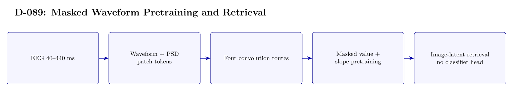

# D-089 Architecture

The image above is rendered from [`ARCHITECTURE.tex`](ARCHITECTURE.tex).

## Data flow

1. EEG 40--440 ms
2. Waveform + PSD patch tokens
3. Four convolution routes
4. Masked value + slope pretraining
5. Image-latent retrieval — no classifier head

## Training interface

- Objective: Masked waveform value/slope loss followed by latent MSE, cosine, and contrastive losses; no classification head.
- Subject scope: Subject 0 only.
- Temporal-effect control: Not excluded: 27/3 development trials are drawn from the first 30; the official last 20 are sealed until final evaluation.

## Authoritative implementation

- [`scripts/run_d089_local_curve_pretrain.py`](scripts/run_d089_local_curve_pretrain.py)
- [`scripts/run_d089_corrected_masked_retrieval.py`](scripts/run_d089_corrected_masked_retrieval.py)
- [`src/d089_masked_retrieval.py`](src/d089_masked_retrieval.py)
