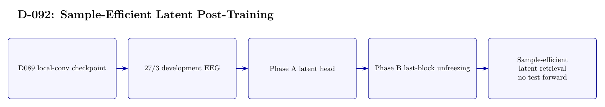

# D-092 Architecture

The image above is rendered from [`ARCHITECTURE.tex`](ARCHITECTURE.tex).

## Data flow

1. D089 local-conv checkpoint
2. 27/3 development EEG
3. Phase A latent head
4. Phase B last-block unfreezing
5. Sample-efficient latent retrieval — no test forward

## Training interface

- Objective: Latent MSE, cosine, contrastive, and consistency losses; no classification head.
- Subject scope: Subject 0 only.
- Temporal-effect control: Development only: 27/3 trials from the first 30; official last-20 EEG is never forwarded.

## Authoritative implementation

- [`scripts/run_d092_sample_efficient_posttrain.py`](scripts/run_d092_sample_efficient_posttrain.py)
- [`src/d092_sample_efficient_latent.py`](src/d092_sample_efficient_latent.py)
- [`config/d092_sample_efficient_posttrain.json`](config/d092_sample_efficient_posttrain.json)
