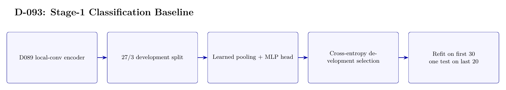

# D-093 Architecture

The image above is rendered from [`ARCHITECTURE.tex`](ARCHITECTURE.tex).

## Data flow

1. D089 local-conv encoder
2. 27/3 development split
3. Learned pooling + MLP head
4. Cross-entropy development selection
5. Refit on first 30 — one test on last 20

## Training interface

- Objective: 80-way cross-entropy with label smoothing 0.05.
- Subject scope: Subject 0 only.
- Temporal-effect control: Not excluded: 27/3 development trials are drawn from the first 30, followed by refit on all 30 and one test on the last 20.

## Authoritative implementation

- [`scripts/run_d093_stage1_classification_baseline.py`](scripts/run_d093_stage1_classification_baseline.py)
- [`src/d093_stage1_classifier.py`](src/d093_stage1_classifier.py)
- [`config/d093_stage1_classification_baseline.json`](config/d093_stage1_classification_baseline.json)
