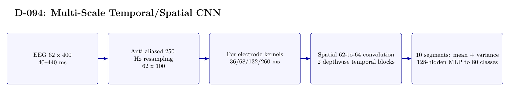

# D-094 Architecture

The image above is rendered from [`ARCHITECTURE.tex`](ARCHITECTURE.tex).

## Data flow

1. EEG 62 x 400 — 40--440 ms
2. Anti-aliased 250-Hz resampling — 62 x 100
3. Per-electrode kernels — 36/68/132/260 ms
4. Spatial 62-to-64 convolution — 2 depthwise temporal blocks
5. 10 segments: mean + variance — 128-hidden MLP to 80 classes

## Training interface

- Objective: 80-way cross-entropy with label smoothing 0.05.
- Subject scope: Subject 0 only.
- Temporal-effect control: Development only: 27/3 trials from the first 30; the official last 20 receive zero classifier forwards.

## Authoritative implementation

- [`scripts/run_d094_multiscale_cnn_stage1.py`](scripts/run_d094_multiscale_cnn_stage1.py)
- [`src/d094_multiscale_cnn.py`](src/d094_multiscale_cnn.py)
- [`config/d094_multiscale_cnn_stage1.json`](config/d094_multiscale_cnn_stage1.json)
