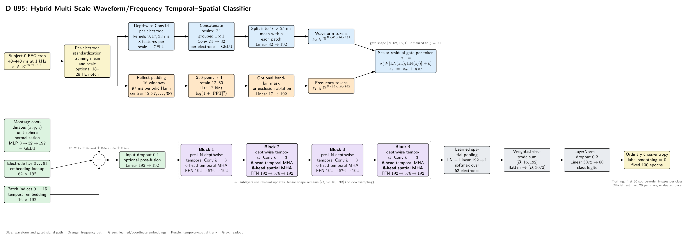

# D-095 Architecture

The image is rendered from [`ARCHITECTURE.tex`](ARCHITECTURE.tex) and follows the executed tensor path in [`model.py`](model.py). It documents the baseline model and marks the optional operations used by the recorded ablations.

## Code-verified tensor flow

1. **Input and normalization.** A subject-0 trial is cropped to 40--440 ms at 1 kHz, producing `[B, 62, 400]`. Per-electrode mean and scale are estimated from training trials. The default model leaves the spectrum unchanged; the exclusion ablation applies a trial-local Fourier notch before both branches.
2. **Waveform branch.** Three depthwise, per-electrode `Conv1d` branches use 9, 17, and 33 sample kernels. Each produces eight features. Their 24 concatenated features are fused per electrode by a grouped `1 x 1` convolution to 32 features. The result is divided into sixteen non-overlapping 25-sample patches, averaged inside each patch, and projected from 32 to 192 dimensions.
3. **Frequency branch.** Sixteen 97-sample windows are centred on the waveform patch centres using reflection padding. A periodic Hann window and 256-point real FFT produce log-power features. Seventeen bins with centres between 12 and 80 Hz are retained and projected from 17 to 192 dimensions.
4. **Residual frequency fusion.** Separate layer normalizations feed a `Linear(384, 1)` sigmoid gate for every electrode/patch token. Fusion is `z_s = z_w + g z_f`; the gate is initialized to 0.1, so the waveform path initially dominates without disabling frequency gradients.
5. **Embedding sum.** The signal token receives a 192-dimensional electrode-ID embedding, a coordinate embedding from unit-sphere `(x,y,z)` through `3 -> 32 -> 192`, and a 192-dimensional temporal-position embedding. Dropout is 0.1. The `postfusion192` ablation additionally applies `Linear(192, 192)` here; the baseline uses identity.
6. **Temporal/spatial trunk.** Four residual blocks preserve `[B, 62, 16, 192]`. Every block applies pre-normalized depthwise temporal convolution with kernel size 3, six-head temporal self-attention independently per electrode, and a `192 -> 576 -> 192` feed-forward network. Blocks 2 and 4 additionally apply six-head spatial self-attention across the 62 electrodes independently at each time patch. There is no temporal or spatial downsampling.
7. **Readout.** `LayerNorm -> Linear(192, 1) -> softmax` learns one electrode distribution for each of the sixteen patches. The weighted electrode sum has shape `[B, 16, 192]`; flattening yields 3,072 features. `LayerNorm -> Dropout(0.2) -> Linear(3072, 80)` produces logits.

## Block schedule

| Block | Local temporal convolution | Temporal attention | Spatial attention | Feed-forward network |
|---|---:|---:|---:|---:|
| 1 | Depthwise, kernel 3 | 6 heads over 16 patches | No | 192 -> 576 -> 192 |
| 2 | Depthwise, kernel 3 | 6 heads over 16 patches | 6 heads over 62 electrodes | 192 -> 576 -> 192 |
| 3 | Depthwise, kernel 3 | 6 heads over 16 patches | No | 192 -> 576 -> 192 |
| 4 | Depthwise, kernel 3 | 6 heads over 16 patches | 6 heads over 62 electrodes | 192 -> 576 -> 192 |

All convolution, attention, spatial-attention, and feed-forward sublayers update the same tensor through residual connections. Dropout inside the blocks is 0.1.

## Training interface

- Objective: ordinary 80-way cross-entropy with label smoothing set to zero.
- Subject scope: subject 0 only.
- Optimization: AdamW, learning rate `3e-4`, weight decay `0.01`, five warmup epochs, 100 fixed epochs, and gradient clipping at 1.0.
- Split: the first 30 source-order images per class are used for training and the last 20 form the official test. This protocol does not remove temporal/source-order effects.
- Test policy: the fixed epoch-100 endpoint is evaluated once; test results are not used for model selection.

## Recorded architecture variants

| Variant | Frequency branch | 18--28 Hz exclusion | Post-fusion projection |
|---|---:|---:|---:|
| `unified192` | Yes | No | Identity |
| `exclude18to28` | Yes | Yes, before both branches and masked in retained FFT bins | Identity |
| `no_frequency` | No | No | Identity |
| `postfusion192` | Yes | No | `Linear(192, 192)` |

## Authoritative implementation

- [`model.py`](model.py): model layers, tensor-shape checks, frequency extraction, gate, block schedule, pooling, and classifier.
- [`run.py`](run.py): data preparation, split policy, architecture record, training loop, evaluation, and checkpoint contract.
- [`config/config.json`](config/config.json): baseline training and evaluation settings.
- [`test_model.py`](test_model.py): executable shape, bin-count, gate-initialization, block-schedule, pooling, and gradient assertions.
