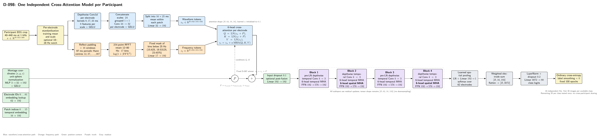

# D-098 Architecture

The image is rendered from [`ARCHITECTURE.tex`](ARCHITECTURE.tex) and follows the executable path in [`model.py`](model.py).

## Code-verified tensor flow

1. **Input.** One participant's EEG is cropped to 40--440 ms at 1 kHz and standardized from that participant's training-only per-electrode statistics, producing `[B, 62, 400]`.
2. **Waveform stream.** Per-electrode depthwise convolutions with kernels 9, 17, and 33 produce 24 features. A grouped `1 x 1` convolution maps 24 to 32, sixteen 25-sample patches are averaged, and `Linear(32, 192)` produces `z_w` with shape `[B, 62, 16, 192]`.
3. **Frequency stream.** Sixteen aligned 97-sample periodic-Hann windows feed a 256-point RFFT. Seventeen 12--80 Hz log-power bins are retained, and the three bins below 25 Hz are zeroed before `Linear(17, 192)` produces `z_f`.
4. **Position context.** A learned electrode-ID embedding, a unit-sphere `(x,y,z)` coordinate MLP, and a learned temporal-position embedding form `P[e,t]` with shape `[62, 16, 192]`.
5. **Directional cross-attention.** For every electrode independently, `LN(z_w + P)` supplies queries, `LN(z_f + P)` supplies keys, and `LN(z_f)` supplies values. Six-head attention runs across the sixteen temporal patches. Fusion is `z_s = z_w + alpha * CrossAttention(Q_w, K_f, V_f)`, with learned scalar `alpha` initialized to 0.1.
6. **Shared trunk.** Position context is added once to `z_s` before input dropout. Four residual blocks apply depthwise temporal convolution, temporal self-attention, and an FFN; blocks 2 and 4 also apply spatial self-attention across electrodes. Shape remains `[B, 62, 16, 192]`.
7. **Readout.** Learned softmax pooling reduces 62 electrodes to one vector per time patch. Flattening `[B, 16, 192]` produces 3,072 features, followed by `LayerNorm`, dropout, and `Linear(3072, 80)`.

## Interpretation boundary

The cross-attention matrix records which frequency time patches each waveform time patch reads. It is not a causal attribution score, and it does not expose individual frequency-bin contributions because the seventeen bins are projected into one 192-dimensional token before attention.

## Training interface

- Participants 0--15 are fitted independently with separate initialization, normalization statistics, optimizer state, checkpoint, and output directory.
- The first 30 source-order images per available class train each model; the remaining 20 are evaluated once after the fixed 100-epoch budget.
- AdamW, five warmup epochs, cosine decay, gradient clipping at 1.0, and bfloat16 autocast are retained from D-095.

Participant 2 is missing one complete class in Part 1, and participant 12 is missing two complete classes in Part 2. Their models use 79 and 78 available classes respectively while retaining the shared 80-logit head. These exceptions are recorded explicitly in each split contract and endpoint metrics.

## Authoritative implementation

- [`model.py`](model.py): branch construction, positional context, cross-attention, trunk, pooling, and classifier.
- [`run.py`](run.py): data preparation, fixed split, training, evaluation, attention summaries, and checkpoint provenance.
- [`test_d098_model.py`](test_d098_model.py): tensor shapes, attention normalization, gradient flow, block schedule, and readout checks.
