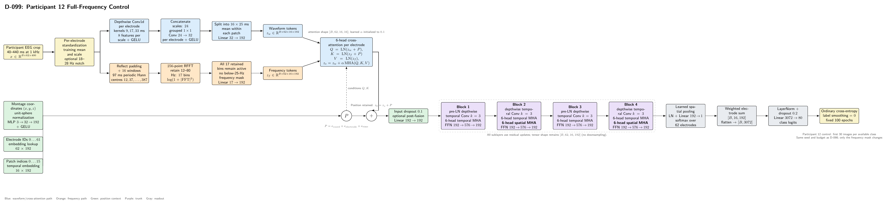

# D-099 Architecture

The diagram is rendered from [`ARCHITECTURE.tex`](ARCHITECTURE.tex). D-099 reuses the code-faithful D-098 model and changes only its frequency-mask configuration.

## Controlled change

- **D-098 participant 12:** the 15.625, 19.53125, and 23.4375 Hz frequency bins are zeroed before `Linear(17, 192)`.
- **D-099 participant 12:** all seventeen retained 12--80 Hz bins remain active.

The waveform branch is unchanged and always receives the complete standardized waveform. The electrode, coordinate, and temporal position context remains in cross-attention Q/K, and `P` is still added after cross-attention. The four-block temporal/spatial trunk, learned electrode pooling, 80-logit classifier, seed, optimizer, split, and 100-epoch budget are unchanged.

## Tensor flow

One participant-12 trial is cropped to `[B, 62, 400]`. The waveform frontend produces `[B, 62, 16, 192]`; aligned 97-sample windows produce seventeen frequency features for each of the same sixteen patches. Waveform queries attend to frequency keys/values independently within each electrode. Four residual blocks retain `[B, 62, 16, 192]`, learned spatial pooling removes the electrode axis, and the flattened 3,072-dimensional representation feeds the 80-class head.

## Authoritative implementation

- [`../D-098/model.py`](../D-098/model.py): unchanged architecture shared with D-098.
- [`run.py`](run.py): D-099 provenance and participant-12 execution wrapper.
- [`config/config.json`](config/config.json): full-frequency control configuration.
